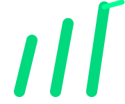

<p align="center">
  
</p>

<h1 align="center">TICKR&middot;PROWL</h1>

<p align="center">
  <em>Hunt the market &middot; Find the edge</em>
</p>

<p align="center">
  
  
  
</p>

<br>

Personal stock analysis app for identifying oversold stocks using technical indicators, fundamentals, and analyst consensus. Tracks your portfolio, watchlist, and sends alerts when signals fire.

---

## Quick Start

Requires [Docker Desktop](https://www.docker.com/products/docker-desktop/) — nothing else.

```bash
git clone https://github.com/nitin-peddabachi/tickrprowl
cd tickrprowl
docker compose up --build
```

Open **http://localhost:3000**. First build takes ~2 minutes; subsequent starts are instant.

```bash
docker compose up    # start
docker compose down  # stop
```

---

## Features

| | |
|---|---|
| **Search** | Look up any stock by ticker or company name for a full analysis |
| **Scanner** | Scan batches or preset lists (S&P 500 sample, Tech, Value) for oversold signals |
| **Watchlist** | Track stocks with notes and target prices; refresh live data on demand |
| **Portfolio** | Import positions from your broker and overlay live analysis |
| **Alerts** | RSI, price, or score rules — checked every 30 min with Telegram push notifications |

---

## Oversold Score (0–100)

The core signal. Higher = more oversold, better opportunity.

| Score | Signal |
|---|---|
| 70+ | **Strong Buy** |
| 50+ | Buy |
| 30+ | Watch |
| <30 | Neutral |

Factors: RSI · Stochastic %K · Bollinger Band position · % from 52-week high · SMA 50/200 · MACD · revenue growth · P/E · EV/EBITDA · FCF yield · DCF valuation · Piotroski F-Score · analyst consensus.

---

## Portfolio Import

Go to **Portfolio → Import CSV**.

| Broker | How to export |
|---|---|
| Fidelity | Accounts → Portfolio → Positions → Download CSV |
| Robinhood | Account → Statements & History → Export → Portfolio CSV |

Re-importing replaces only that broker's rows — other accounts are untouched.

---

## Telegram Alerts

Add to `backend/.env`:

```env
TELEGRAM_BOT_TOKEN=your_token
TELEGRAM_CHAT_ID=your_chat_id
```

Alerts fire when conditions are met, with a 4-hour cooldown per rule.

---

## Data & Privacy

Everything lives in a Docker volume on your machine. Nothing is shared externally. Stock data is cached 60 minutes to reduce API calls.

To wipe all data:

```bash
docker compose down -v
```
