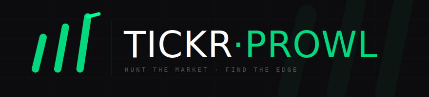

<p align="center">
  
  &nbsp;
  
  &nbsp;
  
  &nbsp;
  
</p>

<p align="center">
  Personal stock analysis app for identifying oversold stocks using technical indicators,<br>
  fundamentals, and analyst consensus — composed into a single actionable brief.
</p>

---

## Quick Start

Requires [Docker Desktop](https://www.docker.com/products/docker-desktop/) — nothing else.

```bash
git clone https://github.com/nitin-peddabachi/tickrprowl
cd tickrprowl
docker compose up --build
```

Open **[http://localhost:3000](http://localhost:3000)**. First build ~2 min; subsequent starts are instant.

```bash
docker compose up     # start
docker compose down   # stop
```

---

## Features

<table>
<tr>
<td width="50%">

**Search**
Look up any stock by ticker or company name for a full analysis brief — technicals, fundamentals, signals, and earnings calendar in one view.

</td>
<td width="50%">

**Scanner**
Scan batches or preset lists (S&P 500 sample, Tech, Value) and filter by sector to surface oversold signals across the market.

</td>
</tr>
<tr>
<td>

**Watchlist**
Track stocks with personal notes and target prices. Refresh live analysis on demand without leaving the list.

</td>
<td>

**Portfolio**
Import positions from your broker and overlay live oversold scores and fundamental data on every holding.

</td>
</tr>
<tr>
<td colspan="2">

**Alerts**
Set RSI, price, or score threshold rules. Background job checks every 30 min and pushes Telegram notifications with a 4-hour cooldown per rule.

</td>
</tr>
</table>

---

## Oversold Score

A 0–100 composite signal — higher means more oversold, better opportunity.

| Score | Signal | What it means |
|:---:|---|---|
| **70+** | Strong Buy | Deeply oversold across multiple factors |
| **50+** | Buy | Oversold with good fundamentals |
| **30+** | Watch | Mild weakness, worth monitoring |
| **<30** | Neutral | No significant oversold signal |

**Factors:** RSI · Stochastic %K · Bollinger Band % · % from 52-week high · SMA 50/200 · MACD · revenue growth · P/E · EV/EBITDA · FCF yield · DCF valuation · Piotroski F-Score · analyst consensus

---

## Portfolio Import

Go to **Portfolio → Import CSV**.

| Broker | How to export |
|---|---|
| Fidelity | Accounts → Portfolio → Positions → Download CSV |
| Robinhood | Account → Statements & History → Export → Portfolio CSV |

Re-importing replaces only that broker's rows — other accounts are untouched.

---

## Telegram Alerts

Add to `backend/.env`:

```env
TELEGRAM_BOT_TOKEN=your_token
TELEGRAM_CHAT_ID=your_chat_id
```

---

## Data & Privacy

Everything lives in a Docker volume on your machine. Nothing leaves it.
Stock data is cached for 60 minutes to limit API calls.

```bash
docker compose down -v   # wipe all data and start fresh
```
